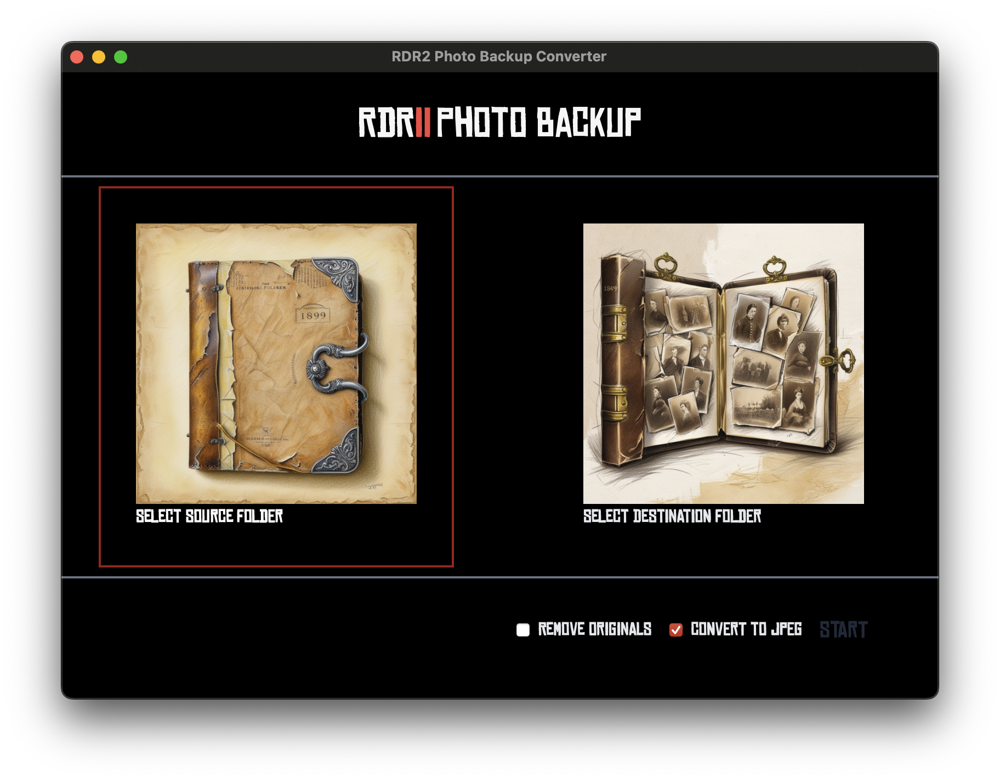

# RDR2 Photo Backup Converter

Backup and convert your Red Dead Redemption 2 photos.

A 200 photos limit is too low for the great memories Arthur and the gang makes.

## Features

- Backup photos
- Convert to JPEG format
- Remove originals after conversion

⚠️ No warranty. Start by not removing the originals in case the game needs the original format.

## Installation

1. See [releases](https://github.com/aldnav/rdr2photobackupconverter/releases)
2. Download the installers (.exe or .msi). Select **Keep anyway** if any warnings show up during the download.
3. Install. User Account Control or SmartScreen mapy prompt. Select "Yes". Proceed with the installation.

## Development

### Recommended IDE Setup

- [VS Code](https://code.visualstudio.com/) + [Tauri](https://marketplace.visualstudio.com/items?itemName=tauri-apps.tauri-vscode) + [rust-analyzer](https://marketplace.visualstudio.com/items?itemName=rust-lang.rust-analyzer)
